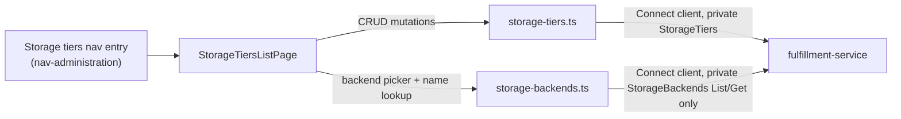

# Storage Framework — UI Design

| Field       | Value                                 |
|-------------|---------------------------------------|
| Author(s)   | Elay Aharoni |
| Jira        | [OSAC-1110](https://redhat.atlassian.net/browse/OSAC-1110), [OSAC-1111](https://redhat.atlassian.net/browse/OSAC-1111) |
| PRD         | [OSAC-1110 PRD](../../enhancement-proposals/enhancements/OSAC-1110-storage-tier/prd.md), [OSAC-1111 PRD](../../enhancement-proposals/enhancements/OSAC-1111-storage-backend/prd.md) |
| Date        | 2026-08-02 |

# 1. Overview

This design specifies the `osac-ui` implementation for `StorageTier` (OSAC-1110) admin management: a single "Storage tiers" list page where Cloud Provider Admins compose named tier offerings (e.g., "fast", "standard") from already-registered `StorageBackend` (OSAC-1111) infrastructure. This design deliberately provides **no admin UI for `StorageBackend` itself** — neither PRD states a UI requirement for either resource, and `StorageBackend` is structurally identical to `NetworkClass`, a platform-scoped infrastructure resource this codebase already manages with zero CRUD UI, surfaced only as a read-only dropdown source [Codebase: `libs/ui-components/src/api/v1/networking.ts`'s `useNetworkClasses()`]. `StorageBackend` data reaches this UI only as read-only support data: a picker in the Tier form and a name lookup for the Tier list table. See the [OSAC-1110](../../enhancement-proposals/enhancements/OSAC-1110-storage-tier/prd.md) and [OSAC-1111](../../enhancement-proposals/enhancements/OSAC-1111-storage-backend/prd.md) PRDs for full product requirements.

# 2. Goals and Non-Goals

## 2.1 Goals

- Follow the existing hooks-layer conventions (`useApiFetch` + `useApiQuery`/`useMutation` + `apiQueryKey`) for `StorageTier` CRUD, private-only with no public counterpart [Codebase: `libs/ui-components/src/api/v1/networking.ts` CRUD shape].
- Model the admin screen on `VirtualNetworksListPage.tsx`/`ClustersTable.tsx`'s table-plus-row-actions shape, since no full-CRUD admin page exists anywhere in `osac-ui` to copy wholesale.
- Consume `StorageBackend` exclusively through a minimal, read-only hook module (`List`/`Get` only, no mutations), mirroring `instance-types.ts`'s read-only shape — `InstanceType` is a comparable resource this codebase deliberately exposes without a CRUD UI.
- Introduce the one UI primitive this codebase lacks a precedent for: an immutable-field-on-edit form (`StorageTier.metadata.name` read-only after creation).

## 2.2 Non-Goals

- Any admin UI for `StorageBackend` (create/edit/delete/lifecycle-state screens) — neither PRD states a UI requirement for it, and this codebase already manages a structurally identical resource (`NetworkClass`) with no CRUD UI, exposing it only as a read-only dropdown source [Codebase: `networking.ts`]. Backend registration and credential rotation remain API/CLI operations outside this design's scope.
- Any UI for Volume/PVC management or inventory — out of scope per OSAC-2872 (Storage Control Plane), which explicitly states "No UX changes in this EP... UI integration is OSAC-984 scope" [Codebase: `enhancement-proposals/enhancements/OSAC-2872-storage-control-plane/design.md`].
- Any tenant-facing surface — neither resource has a public API; there is nothing for a tenant to see or do here [PRD: OSAC-1110 §2.3, OSAC-1111 §2.1].
- Tenant-to-tier assignment UI — owned by the future OSAC Storage Controller (OSAC-23) and OSAC-2872's policy engine, not this design [PRD: OSAC-1110 §2.3].
- A generic, field-type-driven form-rendering system — consistent with how every other resource in this codebase hardcodes its own widgets rather than deriving them from proto metadata [Codebase: `catalogProvision/catalogFieldDefinition.ts`].

# 3. Motivation / Background

OSAC has no API-managed inventory of storage tier offerings today: tier configuration lives in the `STORAGE_TIERS` environment variable plus Kubernetes label conventions, invisible to the OSAC API and to any UI. `StorageTier` replaces this with a DB-backed private gRPC resource that binds a named offering to a registered `StorageBackend` with QoS properties, following the same `GenericServer`/`GenericDAO` pattern as `NetworkClass` [PRD: OSAC-1110 Goals].

Neither the OSAC-1110 nor the OSAC-1111 PRD states a UI requirement — unlike `ClusterVersion` (OSAC-1269), whose PRD explicitly required "The UI console supports catalog management for admins" (FR-9). Both storage PRDs' functional requirements are scoped entirely to the gRPC/REST API surface. In the absence of an explicit requirement, this design follows the closest in-codebase precedent for each resource individually: `StorageTier` composition is an interactive, form-shaped task (pick a backend by name, set QoS values) comparable to nothing currently built in `osac-ui`, while `StorageBackend` registration is a one-time, infrequent action (register an endpoint and credentials for a new storage array) structurally identical to `NetworkClass`, which this codebase manages today with zero admin UI, exposed only as a read-only dropdown source elsewhere in the app. This design builds a UI for the former and deliberately not for the latter.

# 4. Design

## 4.1 Architecture

One private-only hook module with full CRUD for `StorageTier`, plus a minimal read-only hook module for `StorageBackend`, and one list page:

- **`libs/ui-components/src/api/v1/private/storage-tiers.ts`** — `usePrivateStorageTiers(params)` / `usePrivateStorageTier(id)` (List/Get), `useCreateStorageTier()` / `useUpdateStorageTier()` / `useDeleteStorageTier()` (mutations, following `networking.ts`'s `useMutation` + `invalidate*Queries` shape).
- **`libs/ui-components/src/api/v1/private/storage-backends.ts`** — `usePrivateStorageBackends(params)` / `usePrivateStorageBackend(id)` only, no mutations, mirroring `instance-types.ts`'s read-only-only shape [Codebase: `libs/ui-components/src/api/v1/instance-types.ts`]. Exports `STORAGE_BACKEND_READY_LIST_FILTER = "this.status.state == ${StorageBackendState.READY}"`, restricting the Tier form's backend picker to usable backends, mirroring `INSTANCE_TYPE_ACTIVE_LIST_FILTER`.
- **`libs/ui-components/src/pages/admin/StorageTiersListPage.tsx`** (new) — a single list page, no tabs, following `VirtualNetworksListPage.tsx`'s shape: `ListPage`/`ListPageBody` wrapping a plain PatternFly `Table` with a page-level "Create" action [Codebase: `libs/ui-components/src/pages/networking/VirtualNetworksListPage.tsx`, `libs/ui-components/src/components/Page/ListPage.tsx`, `ListPageBody.tsx`].



The diagram shows the one-directional dependency this design keeps: the Tiers page reads `StorageBackend` data for display and selection, but never writes to it. `storage-backends.ts` only ever calls `List`/`Get` on the fulfillment-service — `Create`, `Update`, and `Delete` on `StorageBackends` are never invoked from `osac-ui`.

**List page.** A plain PatternFly `Table` (no generic column abstraction exists in this codebase [Codebase: `ClustersTable.tsx`]) with columns NAME, BACKEND (resolved from `backends[0].backendId` via a batched `List` call to `storage-backends.ts` plus a lookup map, following the `ClusterVersion` design's list-table join pattern rather than one `Get` per row [Codebase: `ClustersTable.tsx` join precedent]), PROTOCOL, STATE (`StorageTierStateLabel`), and a row-actions kebab (Edit, Delete — no lifecycle actions, since `ACTIVE` is the only reachable `StorageTier` state in this phase [PRD: OSAC-1110 FR-9]). Delete surfaces the server's `FAILED_PRECONDITION` (tier still referenced by a Tenant) verbatim via the existing form/toast error convention, with no client-side pre-check [PRD: OSAC-1110 FR-6].

**Create** (`StorageTierCreateModal.tsx`, modeled on `VirtualNetworkCreateModal.tsx`'s Formik+Yup shape): `name` (`InputField`, DNS-label validated — see §4.5), `description` (optional), `backend` (`Select`, single-select, populated by `usePrivateStorageBackends({ filter: STORAGE_BACKEND_READY_LIST_FILTER })` — single-select matches the v0.1 server constraint of exactly one backend per tier; the underlying `backends` array is already shaped to accommodate a future multi-select without a data-model change, see §4.8), `protocol` (`Select`, `NFS`/`BLOCK`), `maxReadBandwidthMbs` / `maxWriteBandwidthMbs` (numeric `InputField`s, Yup `.integer().min(1)`), `quotaGib` (numeric `InputField`, Yup `.integer().min(1)`), `encryptionEnabled` (`Checkbox`). Submits `{ name, description, backends: [{ backendId, protocol, maxReadBandwidthMbs, maxWriteBandwidthMbs, quotaGib, encryptionEnabled }] }` [PRD: OSAC-1110 FR-3].

**Edit** (`StorageTierEditForm.tsx`): `name` renders disabled (immutable [PRD: OSAC-1110 FR-5]); `description` and all of `backends[0]`'s fields — including `backendId` itself — remain editable, since only `metadata.name` is documented as immutable, matching the literal FieldMask partial-update contract. The form shows an inline `Alert` (`variant="info"`) when QoS fields are changed: "Bandwidth and quota changes take effect immediately for existing and new volumes. Changes to encryption or protocol require the associated StorageClass to be recreated before new volumes pick them up; existing volumes are unaffected" — since properties baked into Kubernetes StorageClass parameters cannot propagate to already-created StorageClasses the way policy-level QoS limits can [PRD: OSAC-1110 §7.1 "QoS update propagation limits"].

**Lifecycle state label.** `StorageTierStateLabel.tsx`, co-located under `libs/ui-components/src/components/Storage/` (new directory, following the `Cluster/*StatusLabel.tsx` file-per-resource convention), mapping the enum directly to a PatternFly `Label` without going through the shared `ResourceStatusLabel`/`StatusKind` primitive: `StatusKind` (`ready`/`failed`/`progressing`/`unspecified`) describes runtime reconciliation state, and `StorageTier` has no reconciler — the same reasoning the (unimplemented) `ClusterVersion` design used to reject the same reuse [Codebase: `docs/ui-design.md` §5 Alternatives; `libs/ui-components/src/components/catalogManagement/CatalogItemStatusLabel.tsx` — the closer-fitting direct-`Label` precedent]. `ACTIVE` → green (the only reachable value in this phase). No `StorageBackendStateLabel` is built in this design, since `StorageBackend` has no admin UI to display it in.

**Navigation.** No `nav-administration` section currently exists in `shellNav.ts` — the prior "Catalog management" admin entry and its role-gating were fully removed on 2026-07-30 after the feature that used them (OSAC-2932) was reverted for unrelated reasons; `navRowsForRole(role, t)` today ignores `role` entirely and returns only the two tenant-facing sections [Codebase: `apps/app-frontend/src/shell/shellNav.ts`, verified current as of 2026-08-02]. This design reintroduces role-gated admin navigation from scratch, following the exact shape of the removed code (commit `5ccf669`) as a reference pattern — not live code to extend: `navRowsForRole` conditionally pushes a `nav-administration` section (`sectionId: 'nav-administration'`, label "Administration") containing one entry, `{ id: 'storage-tiers', label: t('Storage tiers'), path: '/admin/storage-tiers' }`, when `role === 'providerAdmin' || role === 'tenantAdmin'`. `AppShell.tsx` gains a matching role-conditional `<Route path="/admin/storage-tiers/*">` wrapping `StorageTiersListPage`, mirroring the removed code's `{(role === 'providerAdmin' || role === 'tenantAdmin') && <Route .../>}` pattern — this is a route-level guard, not just nav-hiding: a non-admin navigating to the URL directly hits the existing catch-all `<Route path="*" element={<Navigate to={defaultRoute} />} />` instead of rendering the page.

## 4.2 Data Model / Schema Changes

No schema changes originate in `osac-ui` — both entities are defined and owned by the fulfillment-service, not yet merged. Two prerequisites block implementation, both outside this design's control:

1. Neither `storage_backend_type_pb`/`storage_backends_service_pb` nor `storage_tier_type_pb`/`storage_tiers_service_pb` exist yet in `libs/types` — the fulfillment-service protos have not merged to `main` [Codebase: verified absent on disk as of 2026-08-02, confirmed still absent after `./bootstrap.sh`]. `pnpm gen-types` must be re-run once they do. **Both** protos are required to compile this design, even though only `StorageTier` gets a CRUD UI — the read-only backend picker and name lookup depend on the `StorageBackend` types too.
2. Both are private-only resources: only `libs/types/src/index-private.ts` needs new exports, mirroring how `NetworkClass`'s private variant exists on disk today with zero consumers [Codebase: `libs/types/src/osac/private/v1/network_classes_service_pb.ts`].

The relevant shapes, per the fulfillment-service design docs (`StorageBackend` fields beyond `id`/`metadata.name`/`status.state` are irrelevant to this design, since the UI never reads or writes `endpoint`, `credentials`, `status.model`, or `status.firmwareVersion`):

```
StorageBackend {
  id, metadata { name },
  status: { state: READY | MAINTENANCE | DECOMMISSIONED }
  // provider, endpoint, credentials, status.model, status.firmwareVersion:
  // present in the full proto but never read or written by this UI
}

StorageTier {
  id, metadata { name },              // name immutable after creation
  description?: string,
  backends: [ BackendAssociation ],    // v0.1: server accepts exactly one
  state: ACTIVE
}
BackendAssociation {
  backendId: string,                   // references StorageBackend.id
  protocol: NFS | BLOCK,
  maxReadBandwidthMbs: int32,
  maxWriteBandwidthMbs: int32,
  quotaGib: int64,
  encryptionEnabled: bool
}
```

## 4.3 API Changes

No new backend API — this section covers the new `osac-ui`-internal hook surface wrapping the fulfillment-service's already-specified `StorageTiers`/`StorageBackends` services [PRD: OSAC-1110 §3.1, OSAC-1111 §3.1]. Two new `ApiRoute` entries in `libs/ui-components/src/api/types.ts`: `'v1/private/storage_tiers'` and `'v1/private/storage_backends'`.

| Hook | RPC | Notes |
|---|---|---|
| `usePrivateStorageTiers(params)` | `List` | pagination + CEL filter + ordering [PRD: OSAC-1110 FR-4] |
| `usePrivateStorageTier(id)` | `Get` | edit-form prefill |
| `useCreateStorageTier()` | `Create` | submits `metadata.name`, `description`, `backends: [...]` |
| `useUpdateStorageTier()` | `Update` | submits `description`/`backends[0].*`; `metadata.name` never included |
| `useDeleteStorageTier()` | `Delete` | — |
| `usePrivateStorageBackends(params)` | `List` | read-only; used for the Tier form's backend picker and the list table's name lookup only |
| `usePrivateStorageBackend(id)` | `Get` | read-only; not currently called by any component in this design, provided for parity with the read-only module shape |

Example — admin creates a tier referencing an existing backend:

```json
// Request (useCreateStorageTier)
{ "object": { "metadata": { "name": "fast" }, "backends": [{ "backendId": "uuid", "protocol": "BLOCK", "maxReadBandwidthMbs": 2000, "maxWriteBandwidthMbs": 2000, "quotaGib": 500, "encryptionEnabled": true }] } }

// Response
{ "object": { "id": "uuid", "metadata": { "name": "fast" }, "backends": [{ "backendId": "uuid", "protocol": "BLOCK", "maxReadBandwidthMbs": 2000, "maxWriteBandwidthMbs": 2000, "quotaGib": 500, "encryptionEnabled": true }], "state": "ACTIVE" } }
```

All changes are additive from the UI's perspective — `StorageTier` is a new resource with no existing consumer to break, and `StorageBackend`'s read-only usage adds no new write surface.

## 4.4 Scalability and Performance

Impact is minimal. The tier catalog is expected to hold tens of entries, not thousands — a platform composes a small number of named tier offerings on top of a similarly small number of registered backends [PRD: OSAC-1111 Motivation, "vendor-agnostic across a small number of registered arrays"]. The list table's backend-name join follows the same batched-`List`-plus-lookup-map pattern used for the `ClusterVersion` cluster-list design to avoid N+1 fetches, but at this scale even a naive per-row `Get` would be inconsequential; the batched approach is adopted for consistency with established convention, not because of a measured performance concern. No new polling behavior beyond the existing 30s background refetch interval already applied to all `useApiQuery` hooks.

## 4.5 Security Considerations

This UI never handles `StorageBackend` credentials, endpoint, or operational metadata — those fields are outside its read set entirely (see §4.2), so there is no credential-exposure surface to reason about here; backend registration and credential rotation happen exclusively via direct API/CLI access, which this design does not cover.

`StorageTier.metadata.name` is validated client-side as a DNS label (RFC 1035) before submission as a defensive measure, since OSAC-2872 (Storage Control Plane) generates the StorageClass name `osac-{tenant}-{tier}` directly from it [Codebase: `enhancement-proposals/enhancements/OSAC-2872-storage-control-plane/design.md` §"StorageClass resources"]; whether the server itself enforces this the way OSAC-1111 does for backend names is unconfirmed (see Open Question 8.1). Write access (create/update/delete) is restricted to Cloud Provider Admins via the existing OPA-based authorization already enforced server-side; the UI's role-gated nav entry and route (§4.1 "Navigation") are a defense-in-depth measure, not a substitute for that server-side check [PRD: OSAC-1110 §"RBAC / Tenancy"].

## 4.6 Failure Handling and Recovery

| Scenario | UI behavior |
|---|---|
| Create/Update: duplicate active tier name | Server's `ALREADY_EXISTS` is shown as a form-level error; admin renames or deletes the conflicting tier first [PRD: OSAC-1110 FR-8]. |
| Create/Update: referenced `StorageBackend` does not exist (e.g., deleted between the picker's `List` call and submission) | Server's `NOT_FOUND` naming the invalid backend ID is shown as a form-level error [PRD: OSAC-1110 FR-7]. |
| Update: concurrent conflicting write | Server's `FAILED_PRECONDITION`/`ABORTED` (stale version) is shown as a submission error; admin re-fetches and retries [PRD: OSAC-1110 FR-5]. |
| Delete: tier still referenced by a Tenant | Server's `FAILED_PRECONDITION` is shown verbatim [PRD: OSAC-1110 FR-6]. |
| Backend picker's `List` call fails or is slow | The `Select` shows its existing loading state; on failure, no options render and the form's existing field-level error display applies — no new error UI. |
| List table's backend-name lookup fails | The BACKEND column falls back to the raw `backendId`, mirroring `ClusterConfigurationCard.tsx`'s existing fallback pattern for an unresolved catalog-item reference. |

## 4.7 RBAC / Tenancy

`StorageTier` is a platform-scoped, non-tenant resource managed exclusively by Cloud Provider Admins [PRD: OSAC-1110 §5]. The "Storage tiers" nav entry and route are visible/reachable only when `role === 'providerAdmin' || role === 'tenantAdmin'` — reintroducing role-gated admin navigation and routing that existed in this codebase before being fully removed on 2026-07-30 (see §4.1 "Navigation"), rather than extending a currently-live mechanism. No new RBAC concept is introduced beyond that reintroduction. There is no tenant-facing visibility to reason about, since neither resource has a public API.

## 4.8 Extensibility / Future-Proofing

The `backends` field is modeled internally as an array even though the create/edit forms only render a single backend row in this phase — when the server relaxes the v0.1 single-backend constraint, the form adds a second row rather than changing its data shape. If backend registration later proves to need a friendlier interface than direct API/CLI access, `storage-backends.ts`'s read-only shape already isolates that boundary cleanly: adding `useCreateStorageBackend()`/`useUpdateStorageBackend()`/`useDeleteStorageBackend()` mutations and a corresponding admin screen would not require changing anything in `storage-tiers.ts` or `StorageTiersListPage.tsx`.

# 5. Alternatives Considered

**Full CRUD UI for both `StorageBackend` and `StorageTier`.** Pros: complete admin control over both resources from one screen. Cons: neither PRD states a UI requirement for `StorageBackend`, and building one mirrors the exact shape (platform-scoped, admin-registered, no reconciler) of `NetworkClass`, a resource this codebase deliberately manages with zero CRUD UI. It also requires a masked-credential-input primitive and a full lifecycle-action UI for a workflow (registering a storage array) that both PRDs describe as infrequent. Rejected in favor of Tiers-only, consistent with the `NetworkClass` precedent.

**Reusing `ResourceStatusLabel`'s `StatusKind` union for `StorageTierStateLabel`.** Pros: one fewer component, established primitive. Cons: `StatusKind`'s semantics (`ready`/`failed`/`progressing`) describe runtime reconciliation state; `StorageTier` has no reconciler. Rejected in favor of a standalone `StateLabel` component, consistent with how the `ClusterVersion` design reached the same conclusion for its own lifecycle states.

**Multi-select backend picker in the Tier form now, instead of single-select.** Pros: no rework when the server relaxes the v0.1 one-backend-per-tier constraint. Cons: builds UI for a server capability that does not exist yet and actively rejects anything but one backend, and would require inventing multi-backend UX (ordering, per-backend QoS override) with no PRD guidance. Rejected: single-select matches the current contract exactly; the underlying data model (`backends` as an array) is already future-proof without a multi-select control.

**Do nothing (continue with `STORAGE_TIERS` env var).** Pros: zero UI work. Cons: this is the status quo the OSAC-1110 PRD is replacing — no API-managed catalog, no UI, blocks OSAC-23/OSAC-2872. Rejected because the PRD requires an API-managed tier catalog with CRUD access, and there is no other planned interface for Cloud Provider Admins to compose tier offerings.

# 6. Observability and Monitoring

No new observability changes. Existing monitoring mechanisms (fulfillment-service gRPC Prometheus metrics and structured logging) already cover the underlying API calls [PRD: OSAC-1110 §"Observability and Monitoring"]; this design adds no client-side telemetry beyond what any other page in the app already emits (none, per current codebase conventions).

# 7. Impact and Compatibility

Purely additive: a new nav section, a new admin page, and two new hook modules (one full-CRUD, one read-only). `navRowsForRole` in `shellNav.ts` changes from an unconditional pass-through to a role-conditional function again (reintroducing logic removed on 2026-07-30, see §4.1), and `AppShell.tsx` gains one role-conditional `<Route>` — both are modifications to existing files, not new ones, but neither changes behavior for any existing route or nav entry: a non-admin's nav and routes are unaffected, and an admin's existing "Services"/"Networking" sections are unaffected. This design cannot compile until two prerequisites land, both outside `osac-ui`: the `StorageBackend`/`StorageTier` protos merging in the fulfillment-service, and the corresponding `pnpm gen-types` regeneration exporting them from `libs/types/src/index-private.ts` — both protos are required even though only `StorageTier` gets a CRUD UI (see §4.2). No version-skew concern exists beyond that — once both are available, this UI has no further cross-component dependency.

# 8. Open Questions

## 8.1 Does the fulfillment-service enforce RFC 1035 DNS-label formatting on `StorageTier.metadata.name`, matching `StorageBackend.metadata.name`'s documented validation?

§4.5 adds client-side validation defensively because OSAC-2872 generates a StorageClass name from the tier name, but the OSAC-1110 design does not state whether the server enforces this the way OSAC-1111 explicitly does for backend names.

- **Owner:** OSAC-1110 design owner (Roy Golan)
- **Impact:** §4.3 (validation rules), §4.5 (Security Considerations).
