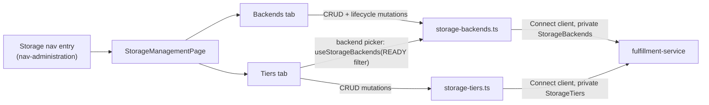

# Storage Framework — UI Design

| Field       | Value                                 |
|-------------|---------------------------------------|
| Author(s)   | Elay Aharoni |
| Jira        | [OSAC-1110](https://redhat.atlassian.net/browse/OSAC-1110), [OSAC-1111](https://redhat.atlassian.net/browse/OSAC-1111) |
| PRD         | [OSAC-1110 PRD](../../enhancement-proposals/enhancements/OSAC-1110-storage-tier/prd.md), [OSAC-1111 PRD](../../enhancement-proposals/enhancements/OSAC-1111-storage-backend/prd.md) |
| Date        | 2026-08-02 |

# 1. Overview

This design specifies the `osac-ui` implementation for `StorageBackend` (OSAC-1111) and `StorageTier` (OSAC-1110): two new private-API, DB-backed catalog resources that let Cloud Provider Admins register storage infrastructure and compose named storage tier offerings on top of it. Neither resource has merged in the fulfillment-service yet — both `design.md` documents are treated here as a fixed API contract, and this document covers only what `osac-ui` builds on top of them. Because a `StorageTier` cannot be created without at least one registered `StorageBackend`, this design delivers both as one combined admin surface: a single "Storage" nav entry with a Backends tab and a Tiers tab, full CRUD on each, and lifecycle-state actions on `StorageBackend`. See the [OSAC-1110](../../enhancement-proposals/enhancements/OSAC-1110-storage-tier/prd.md) and [OSAC-1111](../../enhancement-proposals/enhancements/OSAC-1111-storage-backend/prd.md) PRDs for full product requirements.

# 2. Goals and Non-Goals

## 2.1 Goals

- Follow the existing hooks-layer conventions (`useApiFetch` + `useApiQuery`/`useMutation` + `apiQueryKey`) for all `StorageBackend`/`StorageTier` API access, extended to full CRUD since no existing private hook module in this codebase implements create/update/delete today — every private hook found is list/get-only [Codebase: `libs/ui-components/src/api/v1/private/cluster-catalog-item.ts`].
- Model the admin screens on the closest available working fragments in this codebase — `VirtualNetworkCreateModal.tsx`'s create-modal shape, `ClustersTable.tsx`'s table-plus-row-actions shape, `networking.ts`'s CRUD mutation-hook shape — since no full-CRUD admin page exists anywhere in `osac-ui` to copy wholesale [Codebase: `libs/ui-components/src/components/networking/VirtualNetworkCreateModal.tsx`, `libs/ui-components/src/components/Cluster/ClustersTable.tsx`].
- Combine `StorageBackend` and `StorageTier` under one nav entry with two tabs, reflecting their create-time dependency (a Tier references at least one Backend by ID) and their shared nature as infrastructure-primitive catalogs, rather than splitting them into two independent nav entries [User].
- Introduce two UI primitives with no existing precedent in this codebase: a masked credential input (`StorageBackend.credentials`) and an immutable-field-on-edit form pattern (both resources' identity fields) [Codebase: confirmed absent via full-repo search].
- Target `StorageBackend`'s complete state machine (`READY`/`MAINTENANCE`/`DECOMMISSIONED`) from the outset, since the proto enum already defines all three states [PRD: OSAC-1111 FR-8].

## 2.2 Non-Goals

- Any UI for Volume/PVC management or inventory — out of scope per OSAC-2872 (Storage Control Plane), which explicitly states "No UX changes in this EP... UI integration is OSAC-984 scope" [Codebase: `enhancement-proposals/enhancements/OSAC-2872-storage-control-plane/design.md`].
- Any tenant-facing surface — neither resource has a public API; there is nothing for a tenant to see or do here [PRD: OSAC-1110 §2.3, OSAC-1111 §2.1].
- Tenant-to-tier assignment UI — owned by the future OSAC Storage Controller (OSAC-23) and OSAC-2872's policy engine, not this design [PRD: OSAC-1110 §2.3].
- A generic, field-type-driven form-rendering system for either resource — consistent with how every other resource in this codebase hardcodes its own widgets rather than deriving them from proto metadata [Codebase: `catalogProvision/catalogFieldDefinition.ts`].

# 3. Motivation / Background

OSAC has no API-managed inventory of storage infrastructure or tier offerings today: backend configuration lives in Ansible extra vars (`VAST_ENDPOINT`, `VAST_USERNAME`, `VAST_PASSWORD`) and tier configuration lives in the `STORAGE_TIERS` environment variable plus Kubernetes label conventions. Both are invisible to the OSAC API and to any UI. `StorageBackend` and `StorageTier` replace these with two DB-backed private gRPC resources, following the same `GenericServer`/`GenericDAO` pattern as `NetworkClass` [PRD: OSAC-1111 Goals].

`osac-ui`'s job is to give Cloud Provider Admins the only interface they will have to manage this data, since neither resource has a public API or a CLI covered by this document. Unlike `ClusterVersion` (OSAC-1269), the nearest prior UI design in this codebase, there is no tenant-facing half to build — every surface here is admin-only. But also unlike `ClusterVersion`, there is no working full-CRUD admin page anywhere in `osac-ui` to build from: `ClusterVersion`'s own admin design was never implemented, and the closest actually-built precedent (`ClusterCatalogItem`'s admin panel) has a list view but no create/edit form. This design is therefore assembled from smaller, individually-proven fragments rather than one strong precedent, and specifies two form primitives (masked credentials, immutable-field-on-edit) that this codebase does not yet have.

# 4. Design

## 4.1 Architecture

Two new private-only hook modules — no public counterpart needed for either resource — and one combined admin page with two tabs:

- **`libs/ui-components/src/api/v1/private/storage-backends.ts`** — `usePrivateStorageBackends(params)` / `usePrivateStorageBackend(id)` (List/Get), `useCreateStorageBackend()` / `useUpdateStorageBackend()` / `useDeleteStorageBackend()` (mutations, following `networking.ts`'s `useMutation` + `invalidate*Queries` shape), and `useSetStorageBackendState()` — a dedicated mutation wrapping the same `Update` RPC but scoped to `status.state` only, kept separate from `useUpdateStorageBackend()` so lifecycle transitions remain a distinct, auditable action from general field edits [Codebase: `networking.ts` CRUD shape]. Exports `STORAGE_BACKEND_READY_LIST_FILTER = "this.status.state == ${StorageBackendState.READY}"`, a CEL filter constant used to restrict the Tier form's backend picker to usable backends, mirroring `instance-types.ts`'s `INSTANCE_TYPE_ACTIVE_LIST_FILTER` pattern.
- **`libs/ui-components/src/api/v1/private/storage-tiers.ts`** — `usePrivateStorageTiers(params)` / `usePrivateStorageTier(id)` (List/Get), `useCreateStorageTier()` / `useUpdateStorageTier()` / `useDeleteStorageTier()` (mutations). No dedicated lifecycle-transition hook — `StorageTier` has only one reachable state (`ACTIVE`) in this phase [PRD: OSAC-1110 FR-9].
- **`libs/ui-components/src/pages/admin/StorageManagementPage.tsx`** (new) — a `Tabs`-based shell analogous to `CatalogManagementListPage.tsx`, with a "Backends" tab (default) and a "Tiers" tab, each wrapped in `ListPage`/`ListPageBody` [Codebase: `libs/ui-components/src/components/Page/ListPage.tsx`, `ListPageBody.tsx`].



The diagram shows that the Tiers tab depends on the Backends hook module for its create/edit form's backend picker, but not the reverse — this is the one cross-tab dependency in the design and the reason both resources are delivered as one admin page rather than two independent ones. Every other interaction is a tab talking to its own hook module, which talks to the fulfillment-service through the standard Connect client path; no component calls a Connect client directly.

**Backends tab.** A plain PatternFly `Table` (no generic column abstraction exists in this codebase [Codebase: `ClustersTable.tsx`]) with columns NAME, PROVIDER, ENDPOINT, STATE (`StorageBackendStateLabel`), and a row-actions kebab. Row actions: **Edit** (opens `StorageBackendEditForm` — `metadata.name` and `provider` render as disabled `InputField`s; `endpoint`, `description`, `credentials`, and the operational metadata fields `status.model` / `status.firmwareVersion` / `status.message` are editable [PRD: OSAC-1111 FR-3 "Immutable fields on update", FR-7 "update backend operational metadata (model, firmware_version) and status message via the standard Update RPC"]); **Mark maintenance** / **Reactivate** / **Mark decommissioned** (calls `useSetStorageBackendState()`, with available actions computed from the current state per the full state machine — `READY ⇄ MAINTENANCE`, `READY`/`MAINTENANCE` → `DECOMMISSIONED` terminal [PRD: OSAC-1111 design.md "State transitions"] [User: targets the complete phase-0.2 state machine from the outset rather than phase-1-only, avoiding rework once phase 0.2 ships]); **Delete** (calls `useDeleteStorageBackend()`; no client-side pre-check for in-use references — the server's `FAILED_PRECONDITION` error listing the referencing `StorageTier` IDs is surfaced verbatim via the existing form/toast error convention [PRD: OSAC-1111 §7.1]).

**Create** is a single-step modal (`StorageBackendCreateModal.tsx`, modeled directly on `VirtualNetworkCreateModal.tsx`'s Formik+Yup shape): `name` (`InputField`, DNS-label validated per the generic server's `validateName()` convention), `provider` (`Select`, options `vast`/`ceph`/`pure` [User: constrained to a fixed option list rather than free text — see §4.5]), `endpoint` (`InputField`), `description` (`InputField`, optional), `credentials.username` (`InputField`), `credentials.password` (`TextInput type="password"`, a new primitive — see §4.8). All fields are required except `description` per FR-3.

**Tiers tab.** Same table shape: columns NAME, BACKEND (resolved from `backends[0].backendId` via a batched lookup, following the `ClusterVersion` design's list-table join pattern rather than one `Get` per row [Codebase: `ClustersTable.tsx` join precedent]), PROTOCOL, STATE (`StorageTierStateLabel`), and a row-actions kebab (Edit, Delete — no lifecycle actions, since `ACTIVE` is the only reachable state [PRD: OSAC-1110 FR-9]). Delete surfaces the server's `FAILED_PRECONDITION` (tier still referenced by a Tenant) verbatim, same convention as Backends.

**Create** (`StorageTierCreateModal.tsx`): `name` (`InputField`), `description` (optional), `backend` (`Select`, single-select, populated by `usePrivateStorageBackends({ filter: STORAGE_BACKEND_READY_LIST_FILTER })` [User: single-select, matching the v0.1 server constraint of exactly one backend per tier — the underlying `backends` array is already shaped to accommodate a future multi-select without a data-model change, see §4.8]), `protocol` (`Select`, `NFS`/`BLOCK`), `maxReadBandwidthMbs` / `maxWriteBandwidthMbs` (numeric `InputField`s, Yup `.integer().min(1)`), `quotaGib` (numeric `InputField`, Yup `.integer().min(1)`), `encryptionEnabled` (`Checkbox`). Submits `{ name, description, backends: [{ backendId, protocol, maxReadBandwidthMbs, maxWriteBandwidthMbs, quotaGib, encryptionEnabled }] }` [PRD: OSAC-1110 FR-3].

**Edit** (`StorageTierEditForm.tsx`): `name` renders disabled (immutable [PRD: OSAC-1110 FR-5]); `description` and all of `backends[0]`'s fields — including `backendId` itself — remain editable [User: only `metadata.name` is documented as immutable, so `backendId` is treated as editable, matching the literal FieldMask partial-update contract]. The form shows an inline `Alert` (`variant="info"`) when QoS fields are changed: "Bandwidth and quota changes take effect immediately for existing and new volumes. Changes to encryption or protocol require the associated StorageClass to be recreated before new volumes pick them up; existing volumes are unaffected" — since properties baked into Kubernetes StorageClass parameters cannot propagate to already-created StorageClasses the way policy-level QoS limits can [PRD: OSAC-1110 §7.1 "QoS update propagation limits"].

**Lifecycle state labels.** `StorageBackendStateLabel.tsx` and `StorageTierStateLabel.tsx`, co-located under `libs/ui-components/src/components/Storage/` (new directory, following the `Cluster/*StatusLabel.tsx` file-per-resource convention), each mapping their enum directly to a PatternFly `Label` without going through the shared `ResourceStatusLabel`/`StatusKind` primitive: `StatusKind` (`ready`/`failed`/`progressing`/`unspecified`) describes runtime reconciliation state, and neither `StorageBackend` nor `StorageTier` has a reconciler — the same reasoning the (unimplemented) `ClusterVersion` design used to reject the same reuse [Codebase: `docs/ui-design.md` §5 Alternatives; `libs/ui-components/src/components/catalogManagement/CatalogItemStatusLabel.tsx` — the closer-fitting direct-`Label` precedent]. `StorageBackendStateLabel`: `READY` → green, `MAINTENANCE` → gold, `DECOMMISSIONED` → grey. `StorageTierStateLabel`: `ACTIVE` → green (the only reachable value in this phase).

**Navigation.** One new entry added to `shellNav.ts`'s `nav-administration` section, alongside the existing `catalog-management` entry: `{ id: 'storage', label: t('Storage'), path: '/admin/storage' }` [Codebase: `apps/app-frontend/src/shell/shellNav.ts`]. Routed in `AppShell.tsx` as `path="/admin/storage/*"` to `StorageManagementPage`, following the same wiring as `/admin/catalog/*`.

## 4.2 Data Model / Schema Changes

No schema changes originate in `osac-ui` — both entities are defined and owned by the fulfillment-service, not yet merged. Two prerequisites block implementation, both outside this design's control:

1. Neither `storage_backend_type_pb`/`storage_backends_service_pb` nor `storage_tier_type_pb`/`storage_tiers_service_pb` exist yet in `libs/types` — the fulfillment-service protos have not merged to `main` [Codebase: verified absent on disk as of 2026-08-02, confirmed still absent after `./bootstrap.sh`]. `pnpm gen-types` must be re-run once they do.
2. Both are private-only resources: only `libs/types/src/index-private.ts` needs new exports, mirroring how `NetworkClass`'s private variant exists on disk today with zero consumers [Codebase: `libs/types/src/osac/private/v1/network_classes_service_pb.ts`].

The relevant shapes, per the fulfillment-service design docs:

```
StorageBackend {
  id, metadata { name },              // name immutable after creation
  provider: string,                    // immutable after creation
  description?: string,
  endpoint: string,
  credentials: { username: string, password: string },
  status: { state: READY | MAINTENANCE | DECOMMISSIONED, message?: string, model?: string, firmwareVersion?: string }
}

StorageTier {
  id, metadata { name },              // name immutable after creation
  description?: string,
  backends: [ BackendAssociation ],    // v0.1: server accepts exactly one
  state: ACTIVE
}
BackendAssociation {
  backendId: string,                   // references StorageBackend.id
  protocol: NFS | BLOCK,
  maxReadBandwidthMbs: int32,
  maxWriteBandwidthMbs: int32,
  quotaGib: int64,
  encryptionEnabled: bool
}
```

## 4.3 API Changes

No new backend API — this section covers the new `osac-ui`-internal hook surface wrapping the fulfillment-service's already-specified `StorageBackends`/`StorageTiers` services [PRD: OSAC-1111 §3.1, OSAC-1110 §3.1]. Two new `ApiRoute` entries in `libs/ui-components/src/api/types.ts`: `'v1/private/storage_backends'` and `'v1/private/storage_tiers'`.

| Hook | RPC | Notes |
|---|---|---|
| `usePrivateStorageBackends(params)` | `List` | pagination + CEL filter + ordering [PRD: OSAC-1111 FR-4] |
| `usePrivateStorageBackend(id)` | `Get` | edit-form prefill |
| `useCreateStorageBackend()` | `Create` | submits `metadata.name`, `provider`, `endpoint`, `description`, `credentials` |
| `useUpdateStorageBackend()` | `Update` | submits only changed fields among `endpoint`/`description`/`credentials`/`status.model`/`status.firmwareVersion`/`status.message` [PRD: OSAC-1111 FR-7]; `metadata.name`/`provider` never included |
| `useSetStorageBackendState()` | `Update` | submits only `status.state` |
| `useDeleteStorageBackend()` | `Delete` | — |
| `usePrivateStorageTiers(params)` | `List` | pagination + CEL filter + ordering [PRD: OSAC-1110 FR-4] |
| `usePrivateStorageTier(id)` | `Get` | edit-form prefill |
| `useCreateStorageTier()` | `Create` | submits `metadata.name`, `description`, `backends: [...]` |
| `useUpdateStorageTier()` | `Update` | submits `description`/`backends[0].*`; `metadata.name` never included |
| `useDeleteStorageTier()` | `Delete` | — |

Example — admin creates a backend:

```json
// Request (useCreateStorageBackend)
{ "object": { "metadata": { "name": "vast-01" }, "provider": "vast", "endpoint": "vast-mgmt.example.com:443", "credentials": { "username": "admin", "password": "***" } } }

// Response
{ "object": { "id": "uuid", "metadata": { "name": "vast-01" }, "provider": "vast", "endpoint": "vast-mgmt.example.com:443", "status": { "state": "READY" } } }
```

Example — admin creates a tier referencing that backend:

```json
// Request (useCreateStorageTier)
{ "object": { "metadata": { "name": "fast" }, "backends": [{ "backendId": "uuid", "protocol": "BLOCK", "maxReadBandwidthMbs": 2000, "maxWriteBandwidthMbs": 2000, "quotaGib": 500, "encryptionEnabled": true }] } }

// Response
{ "object": { "id": "uuid", "metadata": { "name": "fast" }, "backends": [{ "backendId": "uuid", "protocol": "BLOCK", "maxReadBandwidthMbs": 2000, "maxWriteBandwidthMbs": 2000, "quotaGib": 500, "encryptionEnabled": true }], "state": "ACTIVE" } }
```

All changes are additive from the UI's perspective — both are new resources with no existing consumer to break.

## 4.4 Scalability and Performance

Impact is minimal. Both catalogs are expected to hold tens of entries, not thousands — a platform registers a handful of storage arrays and composes a similarly small number of named tiers on top [PRD: OSAC-1111 Motivation, "vendor-agnostic across a small number of registered arrays"]. The Tiers tab's backend-name join follows the same batched-`List`-plus-lookup-map pattern used for the `ClusterVersion` cluster-list design to avoid N+1 fetches, but at this scale even a naive per-row `Get` would be inconsequential; the batched approach is adopted for consistency with established convention, not because of a measured performance concern. No new polling behavior beyond the existing 30s background refetch interval already applied to all `useApiQuery` hooks.

## 4.5 Security Considerations

`StorageBackend.credentials` (`username`/`password`) are collected via a masked `TextInput type="password"` on create and never pre-filled on edit — the edit form's credential fields start blank with helper text ("Leave blank to keep the current credentials"), and are included in the `Update` payload only when non-empty. Whether `GetStorageBackend`/`ListStorageBackends` return credentials in plaintext or redacted is unconfirmed (see Open Question 8.1); the blank-by-default convention is followed regardless of the answer, since displaying a stored secret in a form field is poor practice either way. Since neither resource has a public API, there is no risk of credential exposure to tenants through this UI; the private API's existing OPA-enforced admin-only access control is the sole gate, matching how `StorageBackend` inherits the fulfillment-service's security model without change [PRD: OSAC-1111 §"Security Considerations"].

`StorageBackend.provider` is constrained to a fixed `Select` (`vast`/`ceph`/`pure`) rather than free text [User]: OSAC-2872 (Storage Control Plane) resolves the vendor CSI controller via `{provider}.osac-csi-backend.svc.cluster.local` — the exact string value becomes a live Kubernetes Service DNS name downstream, so a typo in a free-text field would silently break volume provisioning with no client-side signal [Codebase: `enhancement-proposals/enhancements/OSAC-2872-storage-control-plane/design.md` §"Vendor controller routing"]. `StorageTier.metadata.name` is validated client-side as a DNS label (RFC 1035) before submission as a defensive measure, since OSAC-2872 generates the StorageClass name `osac-{tenant}-{tier}` directly from it; whether the server itself enforces this the way OSAC-1111 does for backend names is unconfirmed (see Open Question 8.2).

## 4.6 Failure Handling and Recovery

| Scenario | UI behavior |
|---|---|
| Create: duplicate active name (either resource) | Server's `ALREADY_EXISTS` is shown as a form-level error; admin renames or deletes the conflicting record first [PRD: OSAC-1111 FR-9, OSAC-1110 FR-8]. |
| Create/Update: referenced `StorageBackend` does not exist (Tier only) | Server's `NOT_FOUND` naming the invalid backend ID is shown as a form-level error [PRD: OSAC-1110 FR-7]. |
| Update: concurrent conflicting write | Server's `FAILED_PRECONDITION`/`ABORTED` (stale version) is shown as a submission error; admin re-fetches and retries [PRD: OSAC-1111 FR-5, OSAC-1110 FR-5]. |
| Delete Backend: referenced by an active Tier | Server's `FAILED_PRECONDITION`, listing the referencing Tier IDs, is shown verbatim [PRD: OSAC-1111 §7.1]. |
| Delete Tier: referenced by a Tenant | Server's `FAILED_PRECONDITION` is shown verbatim [PRD: OSAC-1110 FR-6]. |
| Invalid state transition (Backend lifecycle action) | Server's `INVALID_ARGUMENT` is shown verbatim; the row action's available-actions computation should make this rare in practice, not eliminate it. |
| List call fails or is slow (backend picker in Tier form) | The `Select` shows its existing loading state; on failure, no options render and the form's existing field-level error display applies — no new error UI. |

## 4.7 RBAC / Tenancy

Both `StorageBackend` and `StorageTier` are platform-scoped, non-tenant resources managed exclusively by Cloud Provider Admins [PRD: OSAC-1111 §5, OSAC-1110 §5]. The "Storage" nav entry and its routes are gated the same way the existing "Catalog management" admin entry is gated — visible only when `role === 'providerAdmin' || role === 'tenantAdmin'` — with no new RBAC mechanism introduced [Codebase: `apps/app-frontend/src/shell/shellNav.ts`]. There is no tenant-facing visibility to reason about for either resource, since neither has a public API.

## 4.8 Extensibility / Future-Proofing

The `backends` field is modeled internally as an array even though the create/edit forms only render a single backend row in this phase — when the server relaxes the v0.1 single-backend constraint, the form adds a second row rather than changing its data shape. `StorageTier`'s QoS fields are plain typed inputs with no bespoke widget; additional QoS properties (e.g., IOPS, latency targets, per the OSAC-1110 PRD's Assumptions) can be added as new form fields without new component architecture. The masked-credential `TextInput type="password"` and the immutable-field-on-edit form pattern introduced here have no existing precedent to build on, but neither is resource-specific — both are written as reusable enough that a future admin-managed resource with the same needs (a secret field, a locked identity field) can reuse them directly rather than reinventing them.

# 5. Alternatives Considered

**Two separate nav entries/pages instead of one combined "Storage" page with tabs.** Pros: mirrors the `ClusterVersion` design's precedent of a dedicated standalone entry per resource. Cons: `StorageTier` cannot be created without `StorageBackend` existing, and both are the same kind of thing (infrastructure primitive), unlike `ClusterVersion` versus catalog items, where the precedent was reasoned against conflating two conceptually different resource kinds. Rejected: the coupling and shared nature argue for one page.

**Reusing `ResourceStatusLabel`'s `StatusKind` union for the state labels.** Pros: one fewer component, established primitive. Cons: `StatusKind`'s semantics (`ready`/`failed`/`progressing`) describe runtime reconciliation state; neither resource has a reconciler, so mapping `READY`/`MAINTENANCE`/`DECOMMISSIONED` onto it risks a future consumer misreading a decommissioned backend as some kind of failure condition. Rejected in favor of standalone `*StateLabel` components, consistent with how the `ClusterVersion` design reached the same conclusion for its own lifecycle states.

**Multi-select backend picker in the Tier form now, instead of single-select.** Pros: no rework when the server relaxes the v0.1 one-backend-per-tier constraint. Cons: builds UI for a server capability that does not exist yet and actively rejects anything but one backend, and would require inventing multi-backend UX (ordering, per-backend QoS override) with no PRD guidance. Rejected: single-select matches the current contract exactly; the underlying data model (`backends` as an array) is already future-proof without a multi-select control.

**Pre-filling credential fields on the edit form (if the API echoes them back).** Pros: lets an admin see the current username without re-entering it. Cons: displaying a stored password in a form field is poor security hygiene regardless of whether the API happens to return it, and no in-repo precedent does this. Rejected in favor of blank-by-default with a "leave blank to keep unchanged" convention.

**Free-text `provider` field.** Pros: matches the proto's `string` type exactly with no UI-side constraint. Cons: OSAC-2872 confirmed the value becomes a literal Kubernetes Service DNS name downstream — a typo fails silently at the CSI layer. Rejected in favor of a constrained `Select`.

**Do nothing (continue with `STORAGE_TIERS` env var and Ansible extra vars).** Pros: zero UI work. Cons: this is the status quo the PRDs are replacing — no API-managed catalog, no UI, blocks OSAC-23/OSAC-2872. Rejected because both PRDs require an API-managed catalog with CRUD access, and there is no other planned interface for Cloud Provider Admins to use it.

# 6. Observability and Monitoring

No new observability changes. Existing monitoring mechanisms (fulfillment-service gRPC Prometheus metrics and structured logging) already cover the underlying API calls [PRD: OSAC-1111 §"Observability and Monitoring", OSAC-1110 §"Observability and Monitoring"]; this design adds no client-side telemetry beyond what any other page in the app already emits (none, per current codebase conventions).

# 7. Impact and Compatibility

Purely additive: a new nav entry, a new admin page, and two new hook modules, none of which modify any existing route, component, or hook. `shellNav.ts`'s `nav-administration.children` array gains one entry alongside the existing `catalog-management` entry. This design cannot compile until two prerequisites land, both outside `osac-ui`: the `StorageBackend`/`StorageTier` protos merging in the fulfillment-service, and the corresponding `pnpm gen-types` regeneration exporting them from `libs/types/src/index-private.ts`. No version-skew concern exists beyond that — once both are available, this UI has no further cross-component dependency.

# 8. Open Questions

## 8.1 Does `GetStorageBackend`/`ListStorageBackends` return `credentials` in plaintext, or are they redacted?

§4.5 keeps the edit form's credential fields blank-by-default regardless of the answer, but the answer affects whether any other part of the admin UI (e.g., a read-only detail view, if one is added later) could inadvertently display a stored password.

- **Owner:** OSAC-1111 design owner (Roy Golan)
- **Impact:** §4.5 (Security Considerations).

## 8.2 Does the fulfillment-service enforce RFC 1035 DNS-label formatting on `StorageTier.metadata.name`, matching `StorageBackend.metadata.name`'s documented validation?

§4.5 adds client-side validation defensively because OSAC-2872 generates a StorageClass name from the tier name, but the OSAC-1110 design does not state whether the server enforces this the way OSAC-1111 explicitly does for backend names.

- **Owner:** OSAC-1110 design owner (Roy Golan)
- **Impact:** §4.3 (validation rules), §4.5 (Security Considerations).
